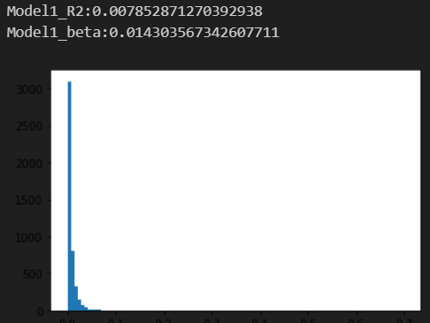
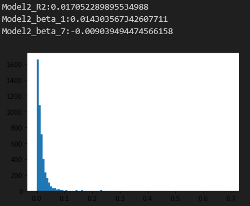
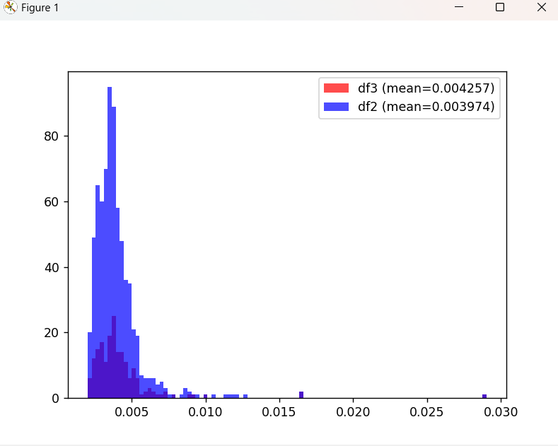
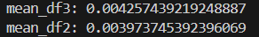
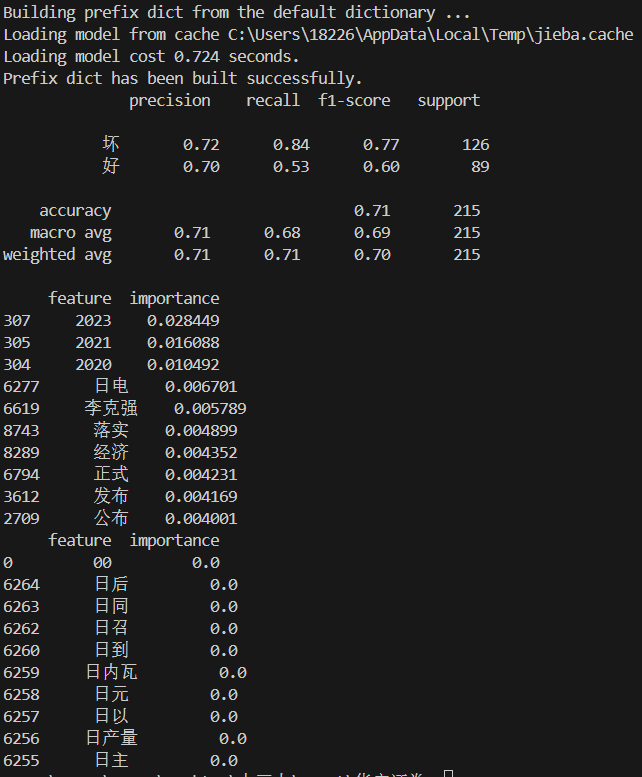

# 日内动量在金融信息发布日的影响
# 文件清单
- `DateInfoProcessAndAnalyse`
    - `Data` 
        - `result.csv`:由`test.ipynb`生成，存储的是交易日和对应的loss_ratio，按照loss_ratio由小到大排序
        - `dateData.csv`:获取的金融信息以及对应的日期，数据来源于国家统计局官网，中国人民银行官网以及国务院官网
        - `dateDataPosition.csv`:结合`result.csv`和`dateData.csv`，存储相关日期的loss_ratio的位次(即线性拟合的程度),loss_ratio,金融信息,按照position从小到大排序
        - `dateDataPositionContent.csv`:`getFinanceDateData.py`爬取的内容,并且结合了`result.csv`的内容，存储了排序,loss_ratio,以及金融信息内容
        - `stockDateData.csv`:`getStockDateData.py`爬取的内容,并且结合了`result.csv`的内容，存储了排序,loss_ratio,以及金融信息内容
        - `getFinanceDateData.py`:爬取新华财经的相关热点财经资讯
        - `getStockDateData.py`:爬取中国经济信息网上的财经报道
    - `analyseDateInfoForwords.py`:结合`dateDataPosition.csv`计算相关日期的线性拟合程度(loss_ratio衡量),并且和所有的样本的分布进行对比，观察是否会有不同
    - `analyseDateInfoBackwords.py`:结合`stockDateData.csv`进行NLP,分析金融文字信息对于线性拟合度好坏的贡献
    - `test.ipynb`:对2021到2023三年间的所有股票在所有交易日的线性回归分析，并且计算了每一个交易日的loss_ratio的值(取mean)
    - `README.md`:说明以及分析文档
    - `image`相关的结果图片
# 步骤以及结果
## 1.分析线性模型
### 文件
`test.ipynb`
### 内容
对2021到2023三年间的所有股票在所有交易日的线性回归分析，并且计算了每一个交易日的loss_ratio的值(取mean),在此期间，处理了缺失值(由于样本量较大，以及对于线性模型的输入参数的长度一致性的控制，这里选择直接剔除的方案)。
### 结果

### 分析
最终呈现的结果是model1的R2的均值是0.7%，model2为1.7%，从分布来看，model2的R2中较大的部分相较model1也更多，说明使用r1和r7二元线性拟合预测，效果会更好。

同时发现对于model2，超参数beta1大于0，beta7小于0，说明r1对r8有正向作用，r7则是负向作用。r1的正向作用符合研报的结论。对于r7，可能产生了投资者的过度反应或者信息效应，导致短期内市场在r8时间段进行调整。负向的影响表明市场对之前的过度波动进行修正，以便收益率回归到长期的平均水平，符合市场的一般规律。

## 2.爬取并且处理数据
### 文件
`getFinanceDateData.py`,`getStockDateData.py`
### 内容
爬取新华财经的相关热点财经资讯，爬取中国经济信息网上的财经报道。其中前者的信息量较少，因此并没有进行相关研究。后续研究的是后者。
### 结果
见`data`文件夹中的相关csv文件
### 分析
在爬取途中，发现国内很多金融网站的相关历史文字信息数据不完善；与之形成横向的对比，微博等社交平台上相关的信息透明、完善，我觉得这个也可以作为一个输入来判断信息对于线性模型的作用，更进一步，甚至可以将其作为一个因子。可惜受限于时间，在此并没有进行相关的工作。

## 3.前向和后向分析验证
### 文件
`analyseDateInfoForwords.py`,`analyseDateInfoBackwords.py`
### 内容
- 结合`dateDataPosition.csv`计算相关日期的线性拟合程度(loss_ratio衡量),并且和所有的样本的分布进行对比，观察是否会有不同
- 结合`stockDateData.csv`进行NLP,将每一天的信息进行处理，构建随机森林分类器，分析金融文字信息对于线性拟合度好坏的贡献
### 结果
- 前向

- 后向

### 分析
#### 前向
结果中，二者的分布和均值基本一致，甚至通过金融信息数据筛选的结果的loss_ratio会更大，说明不是所有的金融信息都会对线性模型有着正向作用。因此更有必要进行后向的分析。
#### 后向
##### 模型评估分析
结果分为两个类别：“坏”和“好”
1. **Precision（精确率）**：
   - 对于“坏”类别，精确率是0.72，意味着所有被预测为“坏”的样本中有72%是真正的“坏”。
   - 对于“好”类别，精确率是0.70，表示所有被预测为“好”的样本中有70%是真正的“好”。
2. **Recall（召回率）**：
   - 对于“坏”类别，召回率为0.84，表示所有实际为“坏”的样本中有84%被正确预测为“坏”。
   - 对于“好”类别，召回率为0.53，意味着所有实际为“好”的样本中只有53%被正确预测为“好”。
3. **F1-Score**：
   - F1值是精确率和召回率的调和平均值。对于“坏”类别，F1值是0.77，表明在这个类别上的综合性能较好。
   - 对于“好”类别，F1值是0.60，表示模型在这个类别上的表现相对较弱。
4. **Support**：
   - “坏”类别的支持度是126，表示在测试数据集中有126个样本属于“坏”类别。
   - “好”类别的支持度是89，表示在测试数据集中有89个样本属于“好”类别。
5. **Accuracy（准确率）**：
   - 总体准确率为0.71，表示在所有215个样本中，有71%的样本被正确分类。
6. **Macro avg（宏平均）**：
   - 宏平均是对每个类别的指标求平均，因此宏平均的精确率为0.71，召回率为0.68，F1值为0.69。它不考虑类别样本数的差异。
7. **Weighted avg（加权平均）**：
   - 加权平均根据每个类别的样本数量加权，因此它更能反映整体表现。加权平均的精确率、召回率和F1值分别为0.71、0.71和0.70。

评估模型：
- 模型对“坏”类别的预测表现优于“好”类别，尤其是在召回率上，模型能够识别大部分的“坏”样本。
- 然而，“好”类别的召回率较低（0.53），说明模型在识别“好”样本时有一定的难度，可能漏掉了一些“好”的样本。
- 整体准确率为71%，说明模型的总体表现尚可，但对于“好”类别的预测能力还有提升空间。
反映了在金融金融信息对日内动量影响的好坏分类中，模型可能更关注降低风险（即更倾向于识别“坏”的样本），但在平衡预测“好”的样本时可能表现不足。这更加说明了，大多数投资者持有的是谨慎的态度，面临利好金融信息，投资者不会无脑的操作；对于风险信息，更是谨慎。
##### 分词分析
对于分词的贡献度，对好和坏分别打印了贡献度前十的词，其实对于坏的，有上千个importance为0的词，即他们都会使得模型倾向于判断为'坏'。通过对比分析，发现能让模型倾向于判断为'好'的词，大多是带有政策的发布、落实以及日期，而'坏'的则是关于国外的、行业领域的或者是带有官腔实则没有很强的信息量的词，这些词的importance都是0。这说明对于政策来说，大家都是选择相信以及响应，侧面反映了政府公信度。对于国外信息，大家选择不关心，对于行业信息，大家则表现的敏感，表现为更加谨慎，现象程度更低。
这个结果，说明，
