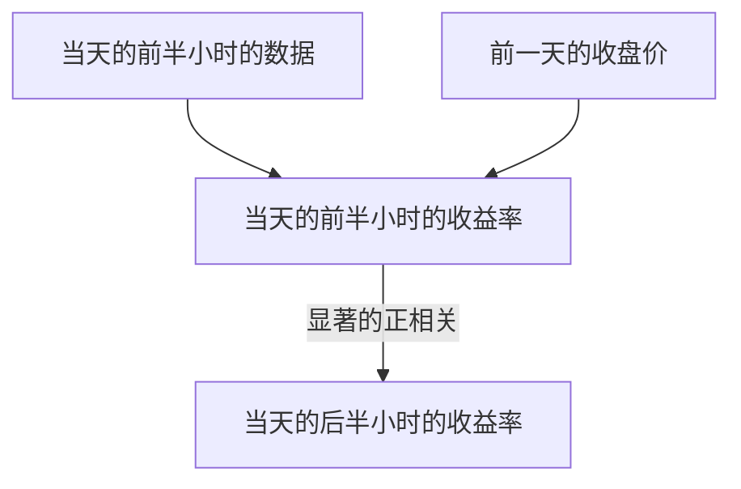

# 市场日内动量--FBDQA期中项目

这是清华大学2024秋季学期金融大数据课程的期中项目，内容是复现研报`【华安金工】市场日内动量——“学海拾珠”系列之八`的内容，以下是我对这份研报的理解以及一些主要公式的呈现

# 主要观点
## 核心结论

### 原因
- 非高频调仓
- 信息接收延迟
这两个因素导致了首个半小时和最后半小时交易的方向相同，使得收益率呈现正相关

## 导出结论
利用日内动量进行的择时策略和均值-方差资产配置策略也可以带来理想收益。

# 日内动量
## 公式
$$
\begin{aligned}
\text{收益率的定义:}\\
\qquad r_{j,t}&=\frac{p_{j,t}}{p_{j-1,t}}-1,&j=1,\ldots,13\\
\text{Model1:}\\
\qquad r_{13,t}&=\alpha+\beta r_{1,t}+\epsilon_t,&t=1,\ldots,T\\
\text{Model2:}\\
\qquad r_{13,t}&=\alpha+\beta_{r_1} r_{1,t}+\beta_{r_{12}} r_{12,t}+\epsilon_t,&t=1,\ldots,T\\
\end{aligned}
$$
对于A股而言，公式为
$$
\begin{aligned}
\text{收益率的定义:}\\
\qquad r_{j,t}&=\frac{p_{j,t}}{p_{j-1,t}}-1,&j=1,\ldots,8\\
\text{Model1:}\\
\qquad r_{8,t}&=\alpha+\beta r_{1,t}+\epsilon_t,&t=1,\ldots,T\\
\text{Model2:}\\
\qquad r_{8,t}&=\alpha+\beta_{r_1} r_{1,t}+\beta_{r_{7}} r_{7,t}+\epsilon_t,&t=1,\ldots,T\\
\end{aligned}
$$
