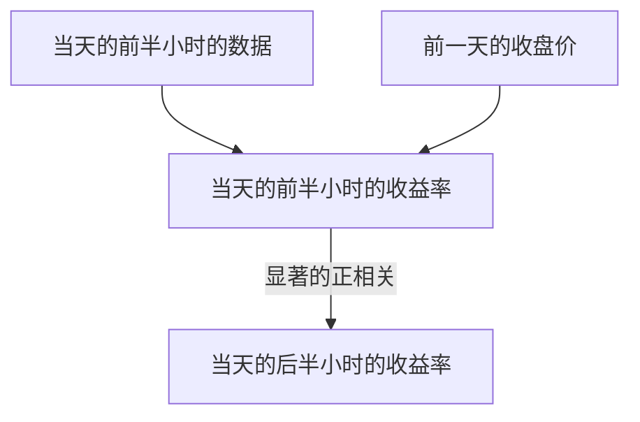
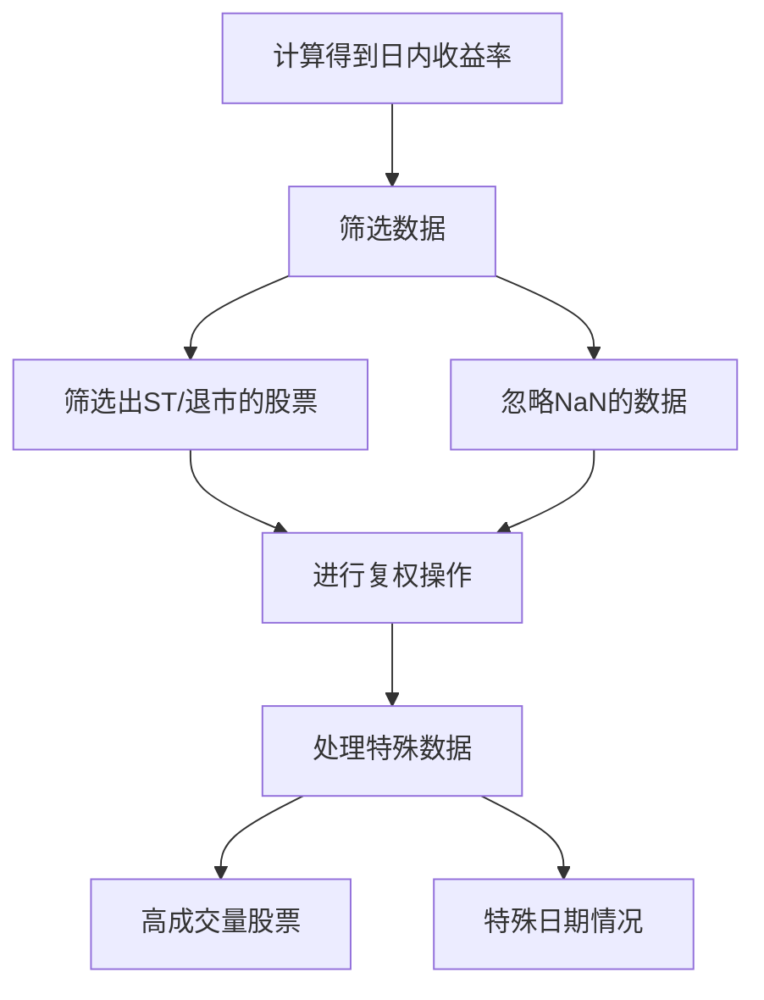
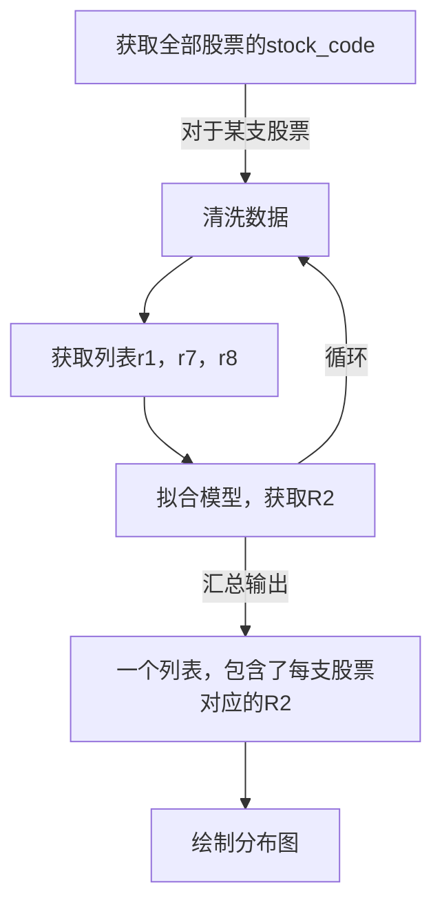

# 市场日内动量--FBDQA期中项目

这是清华大学2024秋季学期金融大数据课程的期中项目，内容是复现研报`【华安金工】市场日内动量——“学海拾珠”系列之八`的内容，以下是对这份研报的一部分的理解、实现步骤以及一些主要公式的呈现

# 主要观点
## 核心结论

### 原因
- 非高频调仓
- 信息接收延迟
这两个因素导致了首个半小时和最后半小时交易的方向相同，使得收益率呈现正相关

## 导出结论
利用日内动量进行的择时策略和均值-方差资产配置策略也可以带来理想收益。

# 日内动量
## 公式
$$
\begin{aligned}
\text{收益率的定义:}\\
\qquad r_{j,t}&=\frac{p_{j,t}}{p_{j-1,t}}-1,&j=1,\ldots,13\\
\text{Model1:}\\
\qquad r_{13,t}&=\alpha+\beta r_{1,t}+\epsilon_t,&t=1,\ldots,T\\
\text{Model2:}\\
\qquad r_{13,t}&=\alpha+\beta_{r_1} r_{1,t}+\beta_{r_{12}} r_{12,t}+\epsilon_t,&t=1,\ldots,T\\
\end{aligned}
$$
对于A股而言，公式为
$$
\begin{aligned}
\text{收益率的定义:}\\
\qquad r_{j,t}&=\frac{p_{j,t}}{p_{j-1,t}}-1,&j=1,\ldots,8\\
\text{Model1:}\\
\qquad r_{8,t}&=\alpha+\beta r_{1,t}+\epsilon_t,&t=1,\ldots,T\\
\text{Model2:}\\
\qquad r_{8,t}&=\alpha+\beta_{r_1} r_{1,t}+\beta_{r_{7}} r_{7,t}+\epsilon_t,&t=1,\ldots,T\\
\end{aligned}
$$

# 数据获取
## 日数据获取
使用实训平台的接口获取数据，对每支股票进行分析，时间范围为2021到2023三年
## 金融信息
- 数据量较小的，在相关官方金融网站上人工查找、筛选、存档
- 数据量较大的，脚本爬取

# 数据清洗
## 步骤

# 日内动量验证
对于每一支股票的每一天数据，清洗之后，取出编号为1，7，8的收益率加入到这支股票对应的列表`r1`,`r7`,`r8`中，分别运用model1和model2拟合，获取相关数据

# 金融信息对R2的影响
获取相关金融信息，然后对金融信息和R2进行双向的作用分析

# 条件影响和稳定性
分析r1的正负对于相关性的影响，以及分析模型对于不同金融产品的稳定性

# 多模型交叉验证
对比分析了多种模型的R2，分析相关模型的效果
